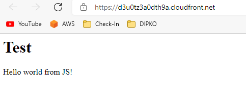
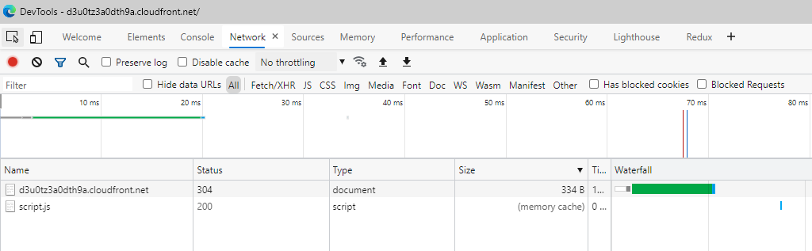
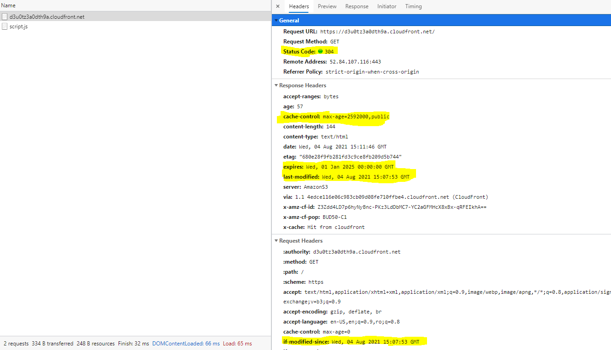
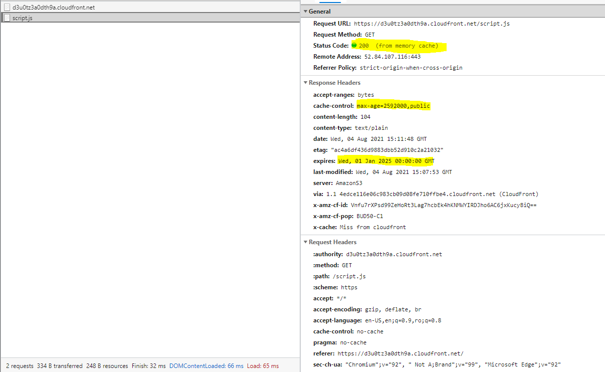

## AWS PoC - CloudFront S3 Cache Headers

Applying the terraform stack in this repository will create a CF distribution backed by an S3 bucket with a simple HTML file and a linked script. These files have explicit cache-control and expiration metadata specified, which should translate to HTTP response headers.

The core point is in [main.tf#108](./main.tf#L108).

### Results
Opening the CloudFront distribution loads the simple HTML file:

Refreshing it and opening the network tab shows that the cache is used. One file uses a ["if-modified-since"](https://developer.mozilla.org/en-US/docs/Web/HTTP/Headers/If-Modified-Since) and the other file uses the in-memory cache directly.

The index.html file headers:

The script.js file headers:

